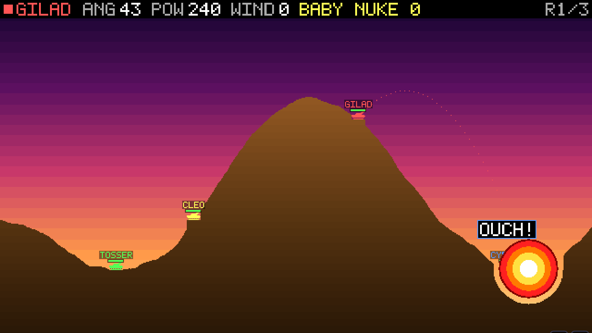

# Scorched Earth (mobile)

A remake of the 1991 DOS artillery classic **Scorched Earth** ("The Mother of All Games") that runs in any modern browser, installs to your phone's home screen, and lets you play **pass-and-play** on one phone or **online** with friends on their own phones.



Same visuals, same gameplay: 640×360 pixel battlefield with gradient skies and strata-shaded hills, tiny tanks, ringed explosions, falling dirt, wind, walls, talking tanks, a shop between rounds and the whole 1.5-era arsenal. Only better: touch controls, drag-to-aim, an online mode, and no DOSBox required.

## Play

* **Hosted:** once GitHub Pages is enabled for this repo (Settings → Pages → Source: *GitHub Actions*), the game is served at `https://<owner>.github.io/scorched/` on every push to `main`. Open it on your phone, and use "Add to Home Screen" to install it. It works offline after the first load.
* **Locally:** `npm start` then open <http://localhost:8080>. The server also prints your Wi-Fi address so phones on the same network can join in.
* **Anywhere:** it is a plain static site with no build step and no dependencies. Copy the folder to any web host.

## Playing with others

**Pass & Play.** Everyone shares one phone. Add up to ten players, human or computer, and pass the phone around. The game shows a "pass to …" card between human turns.

**Online.** One player taps *Host online game* and gets a four-letter room code (and a share link). Friends tap *Join online game* and enter the code. The host can add computer tanks, sets the number of rounds, and starts the game. Every phone runs the exact same simulation in lockstep and only turn commands travel over the wire, so it uses a trickle of data and stays perfectly in sync.

* Connections are peer-to-peer over WebRTC. The free public [PeerJS](https://peerjs.com) signalling server is used by default to introduce peers; no game data passes through it.
* If a player drops out, the computer takes over their tank. If they rejoin with the same name, they get it back. If the host drops, the other phones carry on offline against computer opponents.
* Some mobile networks (symmetric NAT) block direct peer-to-peer connections. If joining fails, try Wi-Fi, or run your own [PeerServer](https://github.com/peers/peerjs-server) with a TURN server and enter its address under *Settings → Advanced: online relay server*.

## Controls

| Touch | Keyboard |
|---|---|
| Drag anywhere on the battlefield: left/right changes the angle, up/down the power | `←` `→` angle, `↑` `↓` power (`Shift` for bigger steps), `PgUp`/`PgDn` power ±100 |
| ◀ ▶ − + buttons, hold to repeat | `Tab` / `Shift+Tab` cycle weapons |
| WEAPON and ITEMS sheets | `W` weapons, `I` items |
| FIRE | `Space` or `Enter` |
| ⏩ fast-forward computer turns, ☰ menu | `F` fast-forward, `Esc` menu |

Angle 0 points right, 90 straight up, 180 left. Wind pushes shells in the direction of the arrow. A ▼ marker along the top edge tracks shells that fly off the top of the screen.

## What's in the box

* **Weapons:** Baby Missile, Missile, Baby Nuke, Nuke, Leap Frog, Funky Bomb, MIRV, Death's Head, Napalm, Hot Napalm, Tracer, Smoke Tracer, Baby/normal/Heavy Roller, Riot Charge, Riot Blast, Riot Bomb, Heavy Riot Bomb, Baby/normal/Heavy Digger, Baby/normal/Heavy Sandhog, Dirt Clod, Dirt Ball, Ton of Dirt, Liquid Dirt, Laser.
* **Accessories:** Shield, Deflector Shield, Force Shield, Heavy Shield, Mag Deflector, Parachutes, Batteries, Fuel Tanks, Auto Defense.
* **Physics options:** gravity, constant or changing wind, concrete / rubber / spring / wrap-around / no walls (or random per shot), falling dirt on or off, chain-reacting tank explosions.
* **Terrain:** flat, hills, mountains, canyon, or random, with six sky/land colour schemes.
* **Computer players:** Moron, Shooter, Poolshark, Tosser, Chooser, Spoiler and Cyborg, each with its own aim, weapon preferences and shopping habits.
* **Economy:** cash for damage and kills, a round-win bonus, interest, and a shop between rounds.
* **Talking tanks**, sound effects (PC-speaker flavoured), haptics on hits, and a PWA manifest plus service worker for offline play and home-screen install.

## Development

```
npm test    # runs the simulation tests (determinism, every weapon, items, shop, snapshots, AI)
npm start   # static server on port 8080
```

Everything is vanilla ES modules, no bundler:

| File | What it does |
|---|---|
| `src/game.js` | The simulation: rounds, turns, firing, every weapon behaviour, damage, falling, economy, snapshots. Deterministic and DOM-free. |
| `src/physics.js` | Projectile integration shared by the game and the AI aiming search. |
| `src/terrain.js` | Pixel terrain: generation, craters, tunnels, dirt clods, animated falling dirt. |
| `src/ai.js` | Computer opponents. |
| `src/weapons.js` | Weapon and accessory catalogue and economy constants. |
| `src/render.js`, `src/palette.js`, `src/font.js` | Canvas renderer, colour schemes, bitmap font. |
| `src/main.js`, `src/ui.js`, `src/input.js` | App controller, screens, touch/keyboard input. |
| `src/net.js` | PeerJS wrapper for online rooms. |
| `src/sound.js`, `src/storage.js`, `src/taunts.js` | WebAudio effects, saved preferences, what the tanks say. |
| `test/sim.test.mjs` | Node test suite. |

The online mode is lockstep: the host assigns a sequence number to each command (fire, use item, move, shop) and relays it; each peer applies commands only when its own simulation has settled at the same point, and a checksum travels with every shot so a divergence is detected and repaired with a snapshot from the host. All randomness comes from a seeded generator and transcendental maths are quantised, so Android, iOS and desktop browsers compute identical games.

## Credits

Scorched Earth was written by Wendell Hicken in 1991. This is an independent fan remake written from scratch; it contains no code or assets from the original. Online play uses [PeerJS](https://peerjs.com) (MIT, see `vendor/PEERJS-LICENSE`).
